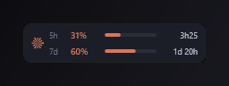
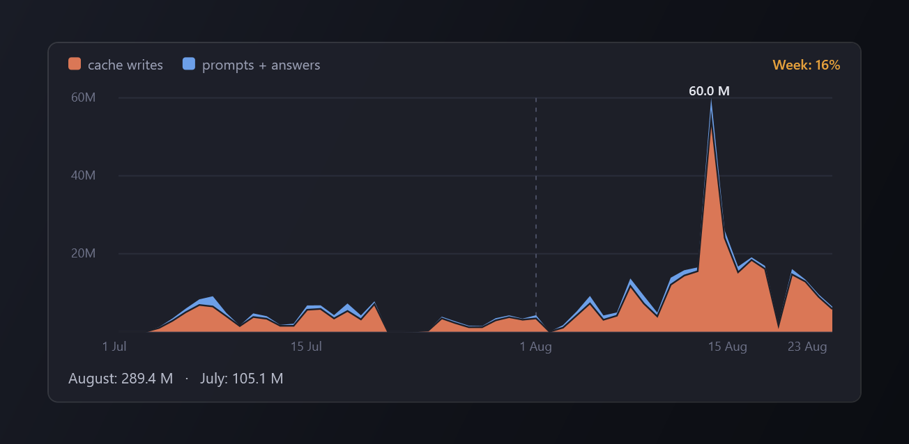

# Claude Usage Widget

Une petite jauge toujours visible, pour Windows, qui indique où en sont vos
limites d'utilisation Claude et quand elles se réinitialisent.

*Read this in [English](README.md).*



Elle se place au-dessus de la barre des tâches et ne passe jamais derrière,
car l'exécutable est compilé avec le privilège `uiAccess` — le même que la
Loupe ou le clavier visuel.

## Fonctions

- Session de 5 h et semaine glissante, avec le compte à rebours de chaque reset
- La couleur passe de l'orange au rouge à l'approche de la limite
- **Ne gêne pas les jeux** : la jauge se masque dès qu'une application plein
  écran est au premier plan, y compris en plein écran sans bordure, et cesse
  de se remettre au premier plan — elle ne peut donc plus faire sortir un jeu
  de son mode d'affichage
- Survol pour le détail, glisser pour déplacer, position mémorisée
- Vieillissement visible — contour orange puis rouge, jauges estompées — dès que
  les données ont plus de 12 minutes : un chiffre figé ne ressemble jamais à un
  chiffre frais
- Opacité réglable, lancement au démarrage de Windows en option
- **English, Français, Español, Deutsch** — clic droit → Langue
- **Graphique de conso locale** — clic droit → *Détail conso locale* : un
  graphique empilé, jour par jour, des tokens neufs (écritures de cache et
  messages + réponses) sur le mois en cours et le mois précédent, calculé
  depuis vos conversations Claude Code locales. Rien ne quitte votre machine.
- **Mises à jour intégrées** — le widget compare sa version à ce dépôt toutes
  les 6 heures ; quand une nouvelle version est publiée, le contour passe à
  l'orange Claude et une entrée *Mise à jour disponible* apparaît en tête du
  clic droit
- Menu clic droit au style Claude — sombre, arrondi, surlignage orange
- Ne se replace au-dessus de la barre des tâches que si elle l'a réellement
  recouvert, au lieu de deux fois par seconde — fini le clignotement



**macOS** : une version pour la barre de menus vit dans
[`mac/`](mac/README.md) — mêmes jauges, même gestion sûre du jeton via le
trousseau, compilée depuis les sources avec les outils gratuits d'Apple.

## Prérequis

- Windows 10 ou 11
- .NET Framework 4.x (présent sur tout Windows encore supporté — rien à installer)
- [Claude Code](https://claude.com/claude-code) installé et connecté une fois

## Installation

Collez ceci dans **PowerShell** et acceptez la demande d'élévation :

```powershell
irm https://raw.githubusercontent.com/Defacedz/claude-usage-widget/main/web-install.ps1 | iex
```

Ou depuis **cmd.exe** :

```bat
powershell -NoProfile -ExecutionPolicy Bypass -Command "irm https://raw.githubusercontent.com/Defacedz/claude-usage-widget/main/web-install.ps1 | iex"
```

Cette commande télécharge le dépôt dans un dossier temporaire et lance
`Installer.ps1`. Si vous préférez lire avant d'exécuter — le bon réflexe face à
n'importe quelle commande `| iex`, et plus encore pour un programme qui touche
à vos identifiants — clonez le dépôt et double-cliquez sur `Installer.bat`.

Dans les deux cas, la fenêtre affiche `[OK]` et le widget apparaît en bas à
gauche. Clic droit pour la langue, l'opacité, le démarrage automatique et
quitter.

### Ce que fait l'installateur

- Compile `ClaudeWidget.cs` **sur votre machine**, avec le compilateur C# déjà
  inclus dans Windows. Rien n'est téléchargé, aucune chaîne de compilation à
  installer.
- Crée un certificat auto-signé `CN=ClaudeWidget Local` et l'ajoute au magasin
  racine de confiance de la machine. Windows n'accorde `uiAccess` qu'à un
  exécutable signé et installé sous `Program Files` : les deux étapes sont donc
  indispensables pour que le widget reste au-dessus de la barre des tâches.
  **Ajouter un certificat racine n'est pas un geste anodin** — voir
  [Désinstallation](#désinstallation) pour le retirer.
- Copie le binaire signé dans `C:\Program Files\ClaudeWidget\` et le lance.

## Ce qui est lu et écrit

Ce programme manipule vos identifiants Claude Code. En détail :

| Chemin | Accès | Pourquoi |
|---|---|---|
| `%USERPROFILE%\.claude\.credentials.json` | lecture **et écriture** | lit le jeton OAuth pour interroger votre usage ; y réécrit le jeton renouvelé (voir ci-dessous) |
| `%APPDATA%\ClaudeWidget\tokens.json` | écriture | cache local du jeton |
| `%APPDATA%\ClaudeWidget\config.json` | écriture | position, opacité, langue |
| `%APPDATA%\ClaudeWidget\log.txt` | écriture | diagnostic, limité à 128 Ko — **ne contient jamais de jeton** |
| `%USERPROFILE%\.claude\projects\**\*.jsonl` | lecture | vos conversations Claude Code locales, additionnées pour le graphique de conso — lecture seule, rien n'est envoyé nulle part |

**Pourquoi réécrire dans `.credentials.json` :** le serveur OAuth fait tourner
les refresh tokens — s'en servir invalide le précédent. Une version antérieure
gardait le nouveau jeton pour elle seule, ce qui laissait Claude Code avec un
jeton mort et imposait un `/login` toutes les quelques heures. Le widget
réinjecte donc `accessToken`, `refreshToken` et `expiresAt` dans le fichier,
sur place, sans toucher aux autres champs.

Vos jetons ne sont transmis qu'à `api.anthropic.com`, `platform.claude.com` et
`console.anthropic.com`. Aucune télémétrie.

Le point d'accès d'usage (`/api/oauth/usage`) n'est pas une API publique
documentée. Il peut changer ou disparaître sans préavis, et ce projet n'est pas
affilié à Anthropic.

## Ajouter une langue

Tout se trouve dans la classe `I18n` de `ClaudeWidget.cs`. Copiez un des blocs
`English()` / `French()`, traduisez la vingtaine de valeurs, puis ajoutez-le à
`Catalog` :

```csharp
public static readonly Strings[] Catalog = { English(), French(), Spanish(), German(), Italian() };
```

Le menu des langues et le fichier de configuration sont tous deux pilotés par
`Catalog` : il n'y a rien d'autre à brancher. Gardez `Short5h` / `Short7d` très
courts, ils s'affichent dans une colonne de 24 pixels. Enregistrez le fichier
en **UTF-8 avec BOM**. Les contributions sont bienvenues.

## En cas de problème

**Les chiffres ne bougent plus.** Clic droit → *Ouvrir le journal*
(`%APPDATA%\ClaudeWidget\log.txt`) donne la cause exacte du dernier échec.

**Plus rien ne se rafraîchit et le journal montre des délais dépassés.** Le
widget demande de l'IPv4 volontairement : sur une box qui annonce un préfixe
IPv6 sans le router réellement, une requête IPv6 reste bloquée jusqu'au timeout
et la jauge se fige. Il rebascule tout seul si l'IPv6 est le seul chemin qui
fonctionne.

**`Claude Code n'est pas connecté`.** Lancez Claude Code une fois pour que
`~/.claude/.credentials.json` existe.

**Le widget a disparu.** Une application plein écran est au premier plan ; il
revient tout seul. Décochez *Masquer en plein écran* pour le garder visible
par-dessus une vidéo en plein écran — au prix de son retour par-dessus les jeux.

## Désinstallation

1. Clic droit sur le widget → *Quitter*
2. Supprimez `C:\Program Files\ClaudeWidget`
3. Supprimez `%APPDATA%\ClaudeWidget`
4. Retirez le certificat : `certlm.msc` → *Autorités de certification racines
   de confiance* → *Certificats* → supprimez **ClaudeWidget Local**, puis
   faites de même dans *Éditeurs approuvés* et *Personnel*

## Licence

MIT — voir [LICENSE](LICENSE).
