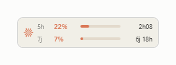

# Claude Usage Widget

Une petite jauge toujours visible, pour Windows, qui indique où en sont vos
limites d'utilisation Claude et quand elles se réinitialisent.

*Read this in [English](README.md).*




Elle se place au-dessus de la barre des tâches et ne passe jamais derrière,
car l'exécutable est compilé avec le privilège `uiAccess` — le même que la
Loupe ou le clavier visuel.

## Fonctions

- Session de 5 h et semaine glissante, avec le compte à rebours de chaque reset
- La couleur passe de l'orange au rouge à l'approche de la limite
- **Ne gêne pas les jeux** : la jauge se masque dès qu'une application plein
  écran est au premier plan, y compris en plein écran sans bordure, et cesse
  de se remettre au premier plan — elle ne peut donc plus faire sortir un jeu
  de son mode d'affichage
- Survol pour le détail, glisser pour déplacer, position mémorisée
- Vieillissement visible — contour orange puis rouge, jauges estompées — dès que
  les données ont plus de 12 minutes : un chiffre figé ne ressemble jamais à un
  chiffre frais
- Opacité réglable, lancement au démarrage de Windows en option
- **English, Français, Español, Deutsch** — clic droit → Langue
- **Deux thèmes** — clic droit → Thème : le *Sombre* d'origine, ou *Ivoire*,
  bâti sur la palette d'Anthropic, pour que le widget se pose sur une barre des
  tâches claire au lieu d'y faire un trou noir
- **Graphique de conso locale** — clic droit → *Détail conso locale* : un
  bâtonnet par jour des tokens neufs (écritures de cache en bas, messages et
  réponses au-dessus) sur le mois en cours et le mois précédent, calculé
  depuis vos conversations Claude Code locales. Rien ne quitte votre machine.
- **Flux local** — le widget lit les limites que Claude Code pousse localement
  à chaque tour, au lieu d'interroger le point d'accès d'usage d'Anthropic,
  qui s'est mis à limiter les requêtes (HTTP 429). Branché automatiquement au
  démarrage ; aucun appel réseau tant que Claude Code tourne, et
  l'interrogation de l'API reste en secours, désormais avec un vrai recul
  progressif. En échange, le terminal gagne une ligne d'état avec la conso.
  Voir [D'où viennent les chiffres](#doù-viennent-les-chiffres).
- **Mises à jour intégrées** — le widget compare sa version à ce dépôt toutes
  les 6 heures, et à chaque clic sur *Actualiser* ; quand une nouvelle version
  est publiée, le contour passe à l'orange Claude et une entrée *Mise à jour
  disponible* apparaît en tête du clic droit
- Menu clic droit au style Claude — arrondi, surlignage orange, aux couleurs du
  thème choisi
- Ne se replace au-dessus de la barre des tâches que si elle l'a réellement
  recouvert, au lieu de deux fois par seconde — fini le clignotement


## Prérequis (Windows)

- Windows 10 ou 11
- .NET Framework 4.x (présent sur tout Windows encore supporté — rien à installer)
- [Claude Code](https://claude.com/claude-code) installé et connecté une fois

## Installation (Windows)

Collez ceci dans **PowerShell** et acceptez la demande d'élévation :

```powershell
irm https://raw.githubusercontent.com/Defacedz/claude-usage-widget/main/web-install.ps1 | iex
```

Ou depuis **cmd.exe** :

```bat
powershell -NoProfile -ExecutionPolicy Bypass -Command "irm https://raw.githubusercontent.com/Defacedz/claude-usage-widget/main/web-install.ps1 | iex"
```

Cette commande télécharge le dépôt dans un dossier temporaire et lance
`Installer.ps1`. Si vous préférez lire avant d'exécuter — le bon réflexe face à
n'importe quelle commande `| iex`, et plus encore pour un programme qui touche
à vos identifiants — clonez le dépôt et double-cliquez sur `Installer.bat`.

Dans les deux cas, la fenêtre affiche `[OK]` et le widget apparaît en bas à
gauche. Clic droit pour la langue, l'opacité, le démarrage automatique et
quitter.

### Ce que fait l'installateur

- Compile `ClaudeWidget.cs` **sur votre machine**, avec le compilateur C# déjà
  inclus dans Windows. Rien n'est téléchargé, aucune chaîne de compilation à
  installer.
- Crée un certificat auto-signé `CN=ClaudeWidget Local` et l'ajoute au magasin
  racine de confiance de la machine. Windows n'accorde `uiAccess` qu'à un
  exécutable signé et installé sous `Program Files` : les deux étapes sont donc
  indispensables pour que le widget reste au-dessus de la barre des tâches.
  **Ajouter un certificat racine n'est pas un geste anodin** — voir
  [Désinstallation](#désinstallation) pour le retirer.
- Copie le binaire signé dans `C:\Program Files\ClaudeWidget\` et le lance.

## Installation (macOS)

La version macOS affiche le même panneau de jauges flottant que sous Windows.
Elle demande les outils en ligne de commande Xcode
(gratuits, `xcode-select --install`) et Claude Code connecté une fois.
Collez ceci dans le **Terminal** :

```sh
curl -fsSL https://raw.githubusercontent.com/Defacedz/claude-usage-widget/main/mac/web-install.sh | sh
```

La commande télécharge ce dépôt dans un dossier temporaire, compile
`mac/ClaudeWidget.swift` **sur votre machine** et installe l'app dans
`~/Applications`. Au premier lancement, autorisez l'accès au trousseau
(« Toujours autoriser ») — c'est là que Claude Code range le jeton sur macOS.
Détails, installation manuelle et désinstallation :
[`mac/README.md`](mac/README.md).

## D'où viennent les chiffres

Deux sources, essayées dans cet ordre :

1. **Le flux local.** Claude Code pousse un blob JSON vers sa commande
   `statusLine` à chaque tour, et ce blob porte les mêmes chiffres 5 h et 7 j
   que le point d'accès d'usage — poussés localement, sans authentification,
   sans limite de débit. Au démarrage, le widget inscrit automatiquement son
   assistant (`ClaudeWidgetFeed.exe`) comme cette commande dans
   `~/.claude/settings.json`. Deux garde-fous : une copie intacte est gardée
   en `settings.json.widget.bak`, et une statusline configurée par un autre
   outil n'est jamais écrasée — c'est le seul cas où le flux reste inactif.
   Claude Code affiche ce que la commande imprime : le widget imprime donc le
   résumé de conso, et le terminal gagne une ligne d'état. Les chiffres
   déposés sont ignorés au-delà de 10 minutes — Claude Code fermé, le widget
   rebascule sur la source 2.

2. **Le point d'accès d'usage** (`/api/oauth/usage`), interrogé au plus toutes
   les 5 minutes. Depuis août 2026 il répond `429 Too Many Requests` bien plus
   agressivement ; le widget recule désormais (10 → 20 → 40 → 60 minutes) au
   lieu d'insister plus fort, continue d'afficher les derniers chiffres
   connus, et se rétablit seul. Le réessai à la minute ne subsiste que pour
   les pannes *réseau*, où il ne coûte rien côté serveur et permet de repartir
   vite après une sortie de veille.

## Ce qui est lu et écrit

Ce programme manipule vos identifiants Claude Code. En détail :

| Chemin | Accès | Pourquoi |
|---|---|---|
| `%USERPROFILE%\.claude\.credentials.json` | lecture **et écriture** | lit le jeton OAuth pour interroger votre usage ; y réécrit le jeton renouvelé (voir ci-dessous) |
| `%APPDATA%\ClaudeWidget\tokens.json` | écriture | cache local du jeton |
| `%APPDATA%\ClaudeWidget\config.json` | écriture | position, opacité, langue |
| `%APPDATA%\ClaudeWidget\log.txt` | écriture | diagnostic, limité à 128 Ko — **ne contient jamais de jeton** |
| `%USERPROFILE%\.claude\projects\**\*.jsonl` | lecture | vos conversations Claude Code locales, additionnées pour le graphique de conso — lecture seule, rien n'est envoyé nulle part |
| `%USERPROFILE%\.claude\settings.json` | écriture, au démarrage | inscrit l'assistant de flux comme entrée `statusLine`, sauf si un autre outil l'occupe déjà ; copie intacte gardée en `settings.json.widget.bak` |
| `%APPDATA%\ClaudeWidget\feed.json` | écriture | les derniers chiffres poussés par Claude Code, déposés pour le widget — **ne contient jamais de jeton** |

**Pourquoi réécrire dans `.credentials.json` :** le serveur OAuth fait tourner
les refresh tokens — s'en servir invalide le précédent. Une version antérieure
gardait le nouveau jeton pour elle seule, ce qui laissait Claude Code avec un
jeton mort et imposait un `/login` toutes les quelques heures. Le widget
réinjecte donc `accessToken`, `refreshToken` et `expiresAt` dans le fichier,
sur place, sans toucher aux autres champs.

Vos jetons ne sont transmis qu'à `api.anthropic.com`, `platform.claude.com` et
`console.anthropic.com`. Aucune télémétrie.

Le point d'accès d'usage (`/api/oauth/usage`) n'est pas une API publique
documentée. Il peut changer ou disparaître sans préavis, et ce projet n'est pas
affilié à Anthropic.

## Ajouter une langue

Tout se trouve dans la classe `I18n` de `ClaudeWidget.cs`. Copiez un des blocs
`English()` / `French()`, traduisez la vingtaine de valeurs, puis ajoutez-le à
`Catalog` :

```csharp
public static readonly Strings[] Catalog = { English(), French(), Spanish(), German(), Italian() };
```

Le menu des langues et le fichier de configuration sont tous deux pilotés par
`Catalog` : il n'y a rien d'autre à brancher. Gardez `Short5h` / `Short7d` très
courts, ils s'affichent dans une colonne de 24 pixels. Enregistrez le fichier
en **UTF-8 avec BOM**. Les contributions sont bienvenues.

## En cas de problème

**Les chiffres ne bougent plus.** Clic droit → *Ouvrir le journal*
(`%APPDATA%\ClaudeWidget\log.txt`) donne la cause exacte du dernier échec.

**`(429) Too Many Requests` dans l'infobulle ou le journal.** Anthropic limite
le débit du point d'accès d'usage non documenté. Le widget recule et se
rétablit seul — et tant que Claude Code tourne, les chiffres passent par le
flux local, sans aucun appel d'API à limiter. Un 429 avec des jauges figées ?
Ouvrez Claude Code.

**Microsoft Defender a bloqué la mise à jour (versions jusqu'à 2026.09.03).**
L'ancien bouton lançait `powershell irm ... | iex` — la forme exacte d'un
« dropper » de logiciel malveillant, que le modèle de Defender flaire à juste
titre (`Trojan:Win32/Commando.A!ml`) et tue en plein vol. Depuis 2026.09.04,
le widget télécharge lui-même l'archive du dépôt puis élève l'installateur
local. Pour sortir d'une vieille version coincée derrière cette détection :
clonez ce dépôt et double-cliquez `Installer.bat` — même résultat, sans motif
télécharger-et-exécuter.

**Aucune ligne d'état n'apparaît dans Claude Code.** Claude Code charge sa
statusline au démarrage d'une session : seules les sessions ouvertes *après*
le branchement du flux l'affichent et poussent les chiffres. Les sessions
déjà en cours ne sont pas concernées — inutile de les fermer, la prochaine
ouverte alimente le widget. Si rien n'apparaît malgré tout, un autre outil
occupe sans doute l'entrée `statusLine` de `~/.claude/settings.json` — le
widget n'écrase jamais une entrée vivante (le journal le dit au démarrage) ;
une entrée dont le fichier cible n'existe plus est morte et remplacée
automatiquement.

**Plus rien ne se rafraîchit et le journal montre des délais dépassés.** Le
widget demande de l'IPv4 volontairement : sur une box qui annonce un préfixe
IPv6 sans le router réellement, une requête IPv6 reste bloquée jusqu'au timeout
et la jauge se fige. Il rebascule tout seul si l'IPv6 est le seul chemin qui
fonctionne.

**`Claude Code n'est pas connecté`.** Lancez Claude Code une fois pour que
`~/.claude/.credentials.json` existe.

**Le widget a disparu.** Une application plein écran est au premier plan ; il
revient tout seul. Décochez *Masquer en plein écran* pour le garder visible
par-dessus une vidéo en plein écran — au prix de son retour par-dessus les jeux.

## Désinstallation

1. Clic droit sur le widget → *Quitter*
2. Supprimez `C:\Program Files\ClaudeWidget`
3. Supprimez `%APPDATA%\ClaudeWidget`
4. Retirez le certificat : `certlm.msc` → *Autorités de certification racines
   de confiance* → *Certificats* → supprimez **ClaudeWidget Local**, puis
   faites de même dans *Éditeurs approuvés* et *Personnel*
5. Retirez l'entrée `statusLine` de `%USERPROFILE%\.claude\settings.json`
   (ou restaurez la copie `settings.json.widget.bak`) — sinon Claude Code
   continuera d'appeler l'assistant de flux supprimé

## Licence

MIT — voir [LICENSE](LICENSE).
